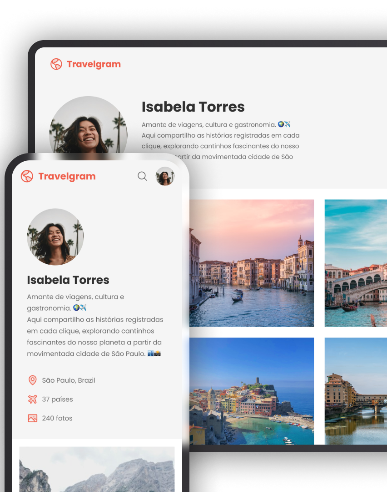

# Travelgram - Perfil de viagens

## 🚀 Tecnologias
Esse projeto foi desenvolvido com as seguintes tecnologias:
- HTML
- CSS
## 💻 Projeto
Este é um site onde os usuários podem compartilhar as imagens dos lugares por onde já viajaram. É um espaço para conectar viajantes, inspirar novas aventuras e compartilhar experiências. 
Travelgram é um projeto desenvolvido durante o curso de Full-Stack na Rocketseat. O objetivo é permitir que os usuários compartilhem suas fotos de viagem, criando uma galeria visual onde cada imagem representa um lugar único que eles já visitaram.

## 📺 Layout
